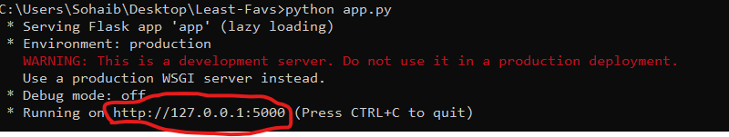

# Make Time

## Contributers

- [Sohaib Ahmed](https://github.com/Sohaib-50)
- [Roconx](https://github.com/Roconx)
- [Top Of Tech](https://github.com/Top-Of-Tech)
- [codingdude](https://github.com/codingdudepy)
- 777Advait

*Note: We worked on a different repository but couldn't host that so we made this copy, hence only one contributer is showing up on Github.*

## Table Of Contents

- [Link To The Website](https://github.com/codingdudepy/Make-Time#link-to-the-webiste-)
- [The Main Idea](https://github.com/codingdudepy/Make-Time#the-main-idea-)
- [How The Site Helps Put Everything Into Action](https://github.com/codingdudepy/Make-Time#how-the-site-helps-put-everything-into-action-)
- [How To Run The App On Your Computer](https://github.com/codingdudepy/Make-Time#how-to-run-the-app-on-your-computer-)

## Link to the webiste 🔗

[https://make-time-timathon.herokuapp.com/](https://make-time-timathon.herokuapp.com/)

## Abstract 📄

Make Time is a simple yet effective productivity planning web app with focus on making each day more meaningful, productive, and enjoyable. It was made during the Timathon competition by the famous youtube channel Tech With Tim.

[About Timathon](https://twtcodejam.net/)

[Tech With Tim Youtube Channel](https://www.youtube.com/channel/UC4JX40jDee_tINbkjycV4Sg)

## The Main Idea 💡

Inspired by the principles in the book "Make Time" by authors Jake Knapp and John Zeratsky, this is a very easy to use but effective productivity app. Being simple to use ensures that people will actually stick to it and not give it up after using it for a short period of time. But it is also very effective as the principles come from experience of people who have worked with big tech companies to make applications that are designed to make their users use them for long periods of time which leads to them being unproductive and unhappy.

Make time helps make your everyday seem more meaningful productive and enjoyable by avoiding the tug of war between the **busy bandwagon** and **Infinity Pools**. Busy bandwagon relate to the endless taks we have and working endlessly to finish them. Infinity pools refer to the endless distractions like apps and services with infinite amount of content.

The more we work (ride the busy bandwagon), the more we feel like we have left to do. We can't just work harder and longer. Instead we need a more holistic approach to everyday life. That's where the concept of planning your day with one **daily highlight** and a **might-do list** comes in.

#### Daily Highlight

The most important task for the day. It isn't the only thing to do, but its something you definitely want to do. It can be from one of the following categories: urgency, satisfaction, or joy. In addition to deciding a daily highlight, some period time must be set aside for it in the day where we do only that task and nothing else.

#### Might-Do List

Basically a todo list, in that it is a list of tasks that you have to do for the day. But called "might-do" to avoid the pressure of doing every single thing every day and the guilt of missing out on doing stuff.

---

The basic idea is that if each day we get 1 very important task (Daily Highlight) done and some tasks, but not necessarily all, each day will feel more enjoyable and meaningful. This is because we'd be doing the most important thing everyday and we tend to remember peak moments. In the long term, looking back at your past weeks, you'll feel much more satisfied and accomplished.

## How the site helps put everything into action 🙌

The following features of our site help put the ideas discussed above into action

#### Daily Highlight

Each day, write down you daily highlight with a planned time here. Research has shown writing stuff down increases the likelyhood of one actually doing them. This page also shows you the past history of your daily highlights, so you can look back and see what you've achieved in the past.

#### Might-Do List

This page implements the idea of might-do list. Items can be ticked off when done and unticked items of each day are transferred to the next day.

#### Activities Suggestor

Can't think of a daily highlight on any day? Or done with the daily highlight but bored and nothing more left to do? Let us suggest an activity! Use the activity suggestor page to choose from the list of topics given and get an activity suggested from one of them.

## How to run the app on your computer 🐱‍💻

#### Prerequisites

* Install Python (Version 3.8 or above)

  * [Python downloads website](https://www.python.org/downloads/)
* Following python libraries (which can be installed by a single command by running `pip install -r requirements.txt` in a terminal while inside the root directory of the  project):

  * Flask
  * Flask-Session
  * Flask-SQLAlchemy

##### Run the web app

In a terminal (while in the root directory of the project), run the comand `python app.py`. If that command doesn't work then try either `python3 app.py` or `py3 app.py`. Running the command will start the web server output a URL/link, which you can visit using any browser to view and start using the website.

